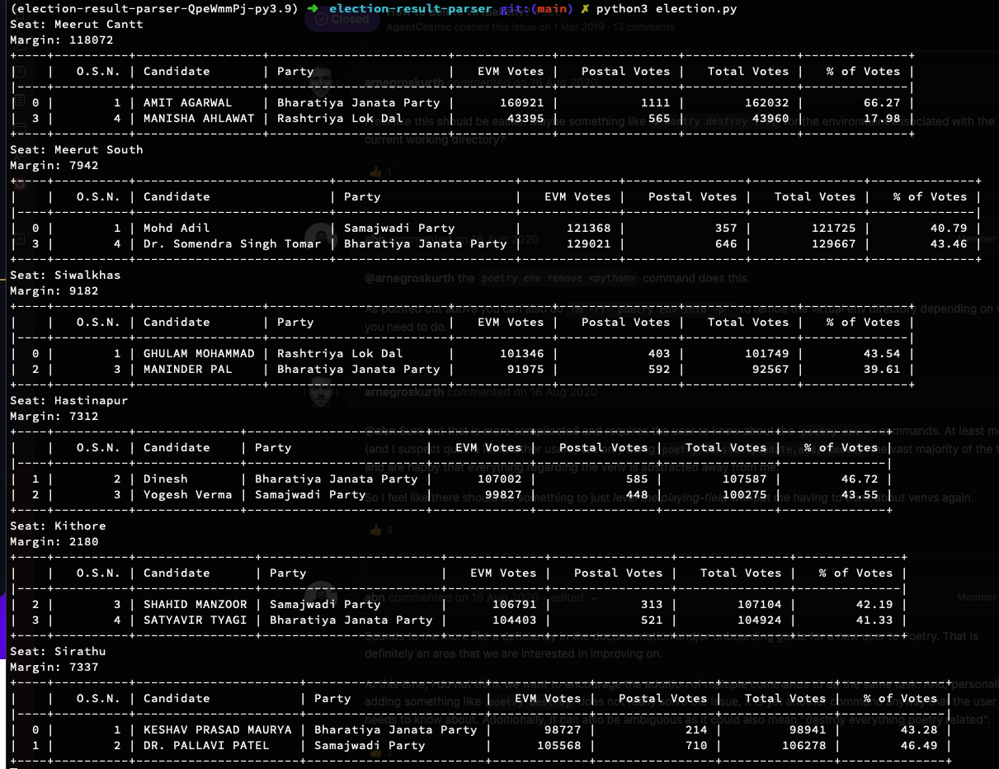

# Election Result Parser
Python script to check live seat wise election results from Election Commission Website


### Prerequisites

* Python 3.9.x
* [Poetry](https://python-poetry.org/docs/)

### Installation

[Using Poetry](https://python-poetry.org/docs/basic-usage/),
create a virtual environment -.
```bash
poetry shell
```

Activate Virtual Environment if not activated -
```bash
source $(dirname $(poetry run which python3))/activate
```

Install Package dependencies -
```bash
poetry install
```

### Run Script
```bash
python3 election.py
```

### Sample Result

